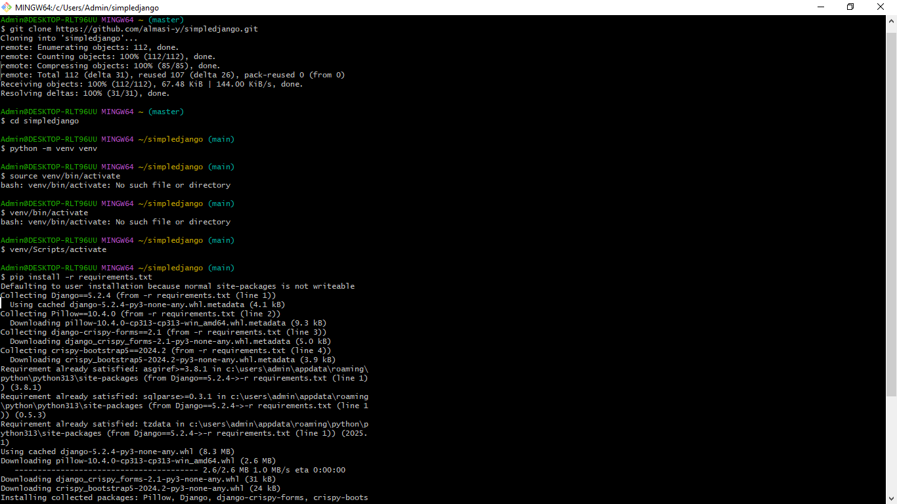
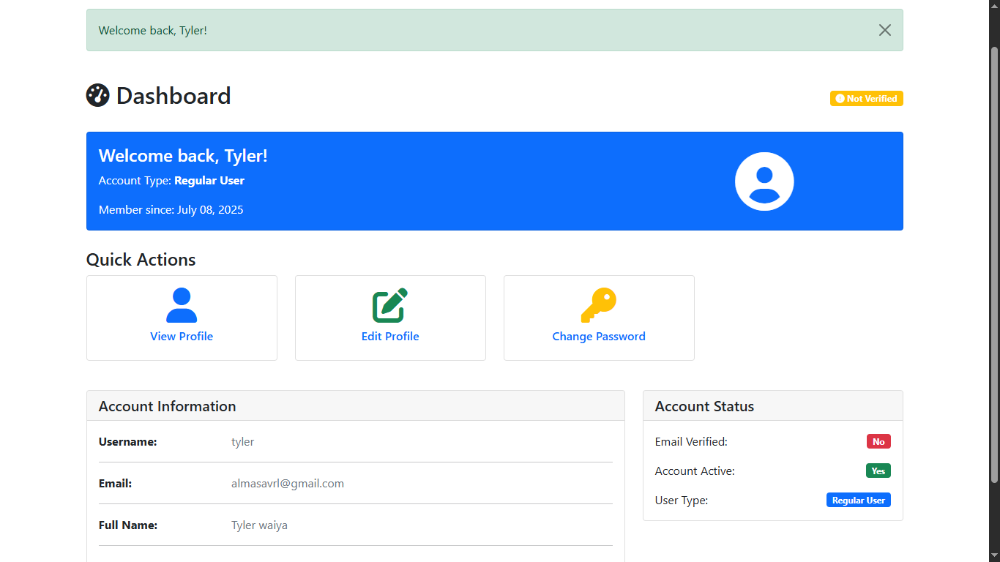
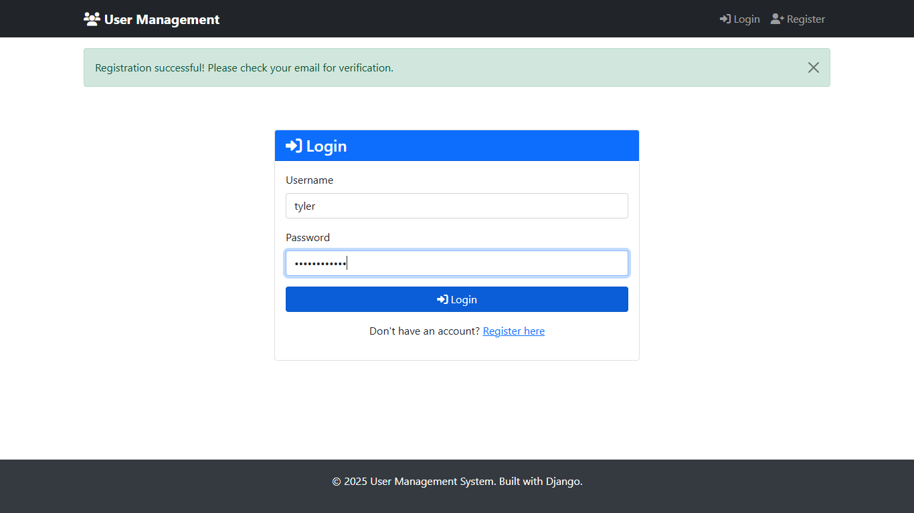

# SimpleDjango

Welcome to **SimpleDjango**!  
This project is designed as a lightweight Django starter with a focus on simplicity and productivity. Whether you're a beginner or looking for a clean base to build upon, this project has you covered.

---

## 🚀 Features

- Modern Django structure
- User authentication out of the box
- Clean, responsive HTML templates
- Easy-to-extend codebase

---

## 🛠️ Installation

Follow these steps to get started:

1. **Clone the Repository**
    ```bash
    git clone https://github.com/almasi-y/simpledjango.git
    cd simpledjango
    ```

2. **Create a Virtual Environment**
    ```bash
    python -m venv venv
    source venv/bin/activate  # On Windows: venv\Scripts\activate
    ```

3. **Install Dependencies**
    ```bash
    pip install -r requirements.txt
    ```

4. **Apply Migrations**
    ```bash
    python manage.py migrate
    ```

5. **Create a Superuser (optional, for admin access)**
    ```bash
    python manage.py createsuperuser
    ```

---

## ▶️ Running the Project

To start the development server, run:
```bash
python manage.py runserver
```
Open your browser and visit [simpledjango](https://simpledjango.onrender.com) to view the app.

---

## 📸 Screenshots

### 1. Project Setup



### 2. Home Page



### 3. Login Page



### 4. Feature Demo


---

## 🤝 Contributing

Pull requests are welcome! For major changes, please open an issue first to discuss what you would like to change.

---

## 📄 License

[MIT](LICENSE)

---

Enjoy building with SimpleDjango! 🎉
